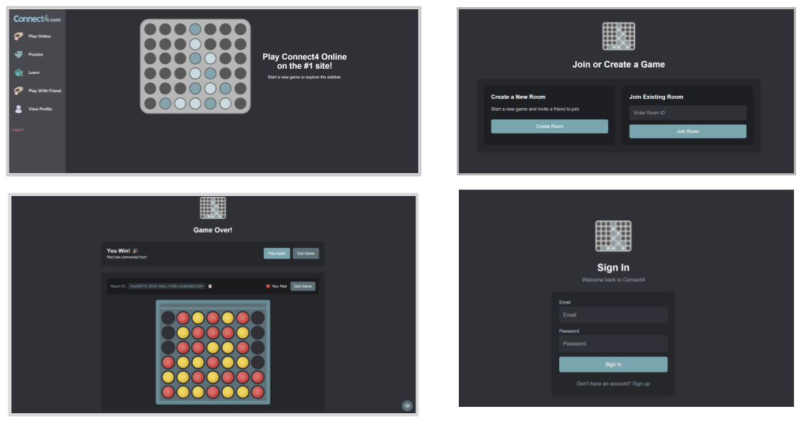

# Connect4com 

<div align="center">
  
</div>

A modern, real-time multiplayer Connect Four game built with React, Node.js, and Socket.IO. Challenge your friends online or play against an AI opponent!

**[Play Now](https://connect4client-seven.vercel.app/)**

## Features

- **Real-time Multiplayer**: Play Connect Four with friends in real-time using WebSocket connections
- **AI Opponent**: Practice against an intelligent bot player
- **User Authentication**: Secure login/signup system with Google OAuth support
- **User Profiles**: Track your game statistics and achievements
- **Sound Effects**: Immersive audio experience with customizable sound controls
- **Responsive Design**: Beautiful UI that works on desktop and mobile devices
- **Room System**: Create private game rooms or join public matches
- **Matchmaking**: Automatic pairing with other players

## Tech Stack

### Frontend
- **React 19** - Modern React with hooks and functional components
- **Vite** - Fast build tool and development server
- **Tailwind CSS** - Utility-first CSS framework
- **React Router DOM** - Client-side routing
- **Socket.IO Client** - Real-time communication
- **Howler.js** - Audio library for sound effects

### Backend
- **Node.js** - JavaScript runtime
- **Express.js** - Web application framework
- **Socket.IO** - Real-time bidirectional communication
- **PostgreSQL** - Relational database
- **Passport.js** - Authentication middleware
- **JWT** - JSON Web Tokens for session management
- **bcrypt** - Password hashing
- **Helmet** - Security middleware
- **Rate Limiting** - API protection

##  Project Structure

```
Connect4com/
├── connect4-com/          # Frontend React application
│   ├── src/
│   │   ├── components/    # Reusable UI components
│   │   ├── contexts/      # React contexts (Auth, Socket, Sound)
│   │   ├── pages/         # Page components
│   │   ├── global_components/ # Shared components
│   │   └── assets/        # Images, fonts, sounds
│   └── public/            # Static assets
├── misaka/                # Backend Node.js server
│   ├── config/           # Database configuration
│   ├── controllers/      # Route controllers
│   ├── models/           # Database models
│   ├── routes/           # API routes
│   └── botPlayer.js      # AI opponent logic
└── railway.toml          # Deployment configuration
```

### Prerequisites

- Node.js (v18 or higher)
- PostgreSQL database
- npm or yarn package manager

### Installation

1. **Clone the repository**
   ```bash
   git clone https://github.com/yourusername/Connect4com.git
   cd Connect4com
   ```

2. **Set up the backend**
   ```bash
   cd misaka
   npm install
   ```

3. **Set up the frontend**
   ```bash
   cd ../connect4-com
   npm install
   ```

4. **Environment Configuration**

   Create a `.env` file in the `misaka` directory:
   ```env
   DATABASE_URL=your_postgresql_connection_string
   JWT_SECRET=your_jwt_secret_key
   GOOGLE_CLIENT_ID=your_google_oauth_client_id
   GOOGLE_CLIENT_SECRET=your_google_oauth_client_secret
   ALLOWED_ORIGINS=http://localhost:5173,http://localhost:5174
   NODE_ENV=development
   ```

5. **Database Setup**
   ```bash
   cd misaka
   node run_migration.js
   ```

### Running the Application

1. **Start the backend server**
   ```bash
   cd misaka
   npm start
   ```
   The server will run on `http://localhost:3000`

2. **Start the frontend development server**
   ```bash
   cd connect4-com
   npm run dev
   ```
   The application will be available at `http://localhost:5173`

##  How to Play

1. **Create an Account**: Sign up or log in to start playing
2. **Choose Game Mode**:
   - **Friendly Match**: Create a room and invite friends
   - **Quick Play**: Get matched with random players
   - **AI Practice**: If match making takes too hard, play with one of our bots!
3. **Game Rules**: Drop your colored discs to connect four in a row (horizontally, vertically, or diagonally)
4. **Win**: Be the first to connect four discs to win the game!


